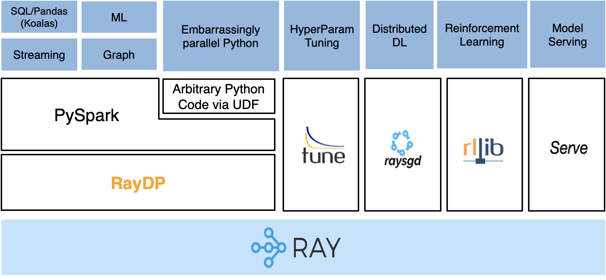

# RayDP

RayDP brings popular big data frameworks including [Apache Spark](https://github.com/apache/spark) to [Ray](https://github.com/ray-project/ray/) ecosystem and integrates with other Ray libraries seamlessly. RayDP makes it simple to build distributed end-to-end data analytics and AI pipeline on Ray by using Spark for data preprocessing, RayTune for hyperparameter tunning, RaySGD for distributed deep learning, RLlib for reinforcement learning and RayServe for model serving.



## Key Features

### Spark on Ray

RayDP enables you to start a Spark job on Ray in your python program without a need to setup a Spark cluster manually. RayDP supports Ray as a Spark resource manger and starts Spark executors using Ray actor directly. RayDP utilizes Ray's in-memory object store to efficiently exchange data between Spark and other Ray libraries. You can use Spark to read the input data, process the data using SQL, Spark DataFrame, or Pandas (via [Koalas](https://github.com/databricks/koalas)) API, extract and transform features using Spark MLLib, and use RayDP Estimator API for distributed training on the preprocessed dataset. 

### Estimator APIs for Distributed Training

RayDP provides high level scikit-learn style Estimator APIs for distributed training. The Estimator APIs allow you to train a deep neural network directly on a Spark DataFrame, leveraging Ray’s ability to scale out across the cluster. The Estimator APIs are wrappers of RaySGD and hide the complexity of converting a Spark DataFrame to a PyTorch/Tensorflow dataset and distributing the training.

## Build and Install


Install PySpark 3.0.0 or 3.0.1. Install ray with the latest nigthly by following this
[page](https://docs.ray.io/en/master/installation.html#daily-releases-nightlies). Below is an example for python 3.7x:

```python
pip install pyspark==3.0.1
# python 3.7x linux
pip install https://s3-us-west-2.amazonaws.com/ray-wheels/latest/ray-2.0.0.dev0-cp37-cp37m-manylinux2014_x86_64.whl
# python 3.7x MacOS
pip install https://s3-us-west-2.amazonaws.com/ray-wheels/latest/ray-2.0.0.dev0-cp37-cp37m-macosx_10_13_intel.whl
```

Build and install RayDP using the following commands:

```shell
./build.sh
pip install dist/raydp*.whl
```

## Get Started
To start a Spark job on Ray, you can use the `raydp.init_spark` API. You can write Spark, PyTorch/Tensorflow, Ray code in the same python program to easily implement an end to end pipeline.

```python
import ray
import raydp
from raydp.torch import TorchEstimator

ray.init()
spark = raydp.init_spark(app_name="RayDP example",
                         num_executors=2,
                         executor_cores=2,
                         executor_memory="4GB")
                         
# Spark DataFrame Code 
df = spark.read.parquet(…) 
train_df = df.withColumn(…)

# PyTorch Code 
model = torch.nn.Sequential(torch.nn.Linear(2, 1)) 
optimizer = torch.optim.Adam(model.parameters())

# You can use the RayDP Estimator API or libraries like RaySGD for distributed training.
estimator = TorchEstimator(model=model, optimizer=optimizer, ...) 
estimator.fit_on_spark(train_df)

```

You can find more examples under the `examples` folder.
