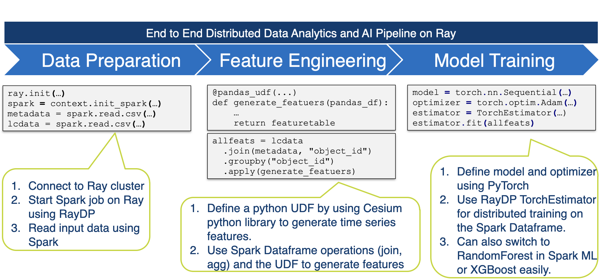

# RayDP: Distributed Data processing on Ray

## Introduction
RayDP is a library can help you finish an end to end job for data processing and model training on single `python` file or with jupyter notebook. [Ray](https://github.com/ray-project/ray/) is an easy and powerful framework and provides useful tools for AI problems(such as, RLlib, Tune, RaySGD and more). And [Apache Spark](https://github.com/apache/spark) is a very popular distribute data processing and analytics framework. RayDP can be considered as the intersection of Apache Spark and Ray. It brings Apache Spark powerful data processing ability into Ray ecosystem. And it allows data processing and model training to coexist better.

## Key Features

### Spark on Ray

We bring Apache Spark as a data processing framework on Ray and seamlessly integrated with other Ray libraries. We now support two ways to running Spark on Ray:

***Standalone***: We will startup a spark standalone cluster to running Spark.

***Native***: In this way, all the Spark executors are running in Ray java actors. And we startup a Ray java actor acts as Spark AppMaster for start/stop Spark executors. We could exchange data between Spark and Ray other components by Ray object store and leverage Apache Arrow format to decrease serialization/deserialization overhead.

### Estimator API for RaySGD

We provide a scikit-learn like API for RaySGD and supports training and evaluating on pyspark DataFrame directly. This hides the underlying details for distributed model training and data exchanging between Spark and Ray. 

## Build and Install

> **Note**: RayDP depends on the Ray and Apache Spark. However, we have to do some modification of the source code for those two framework due to the following reasons. **We will patch those modification to upstream later**. 
>
> * In Spark 3.0 and 3.0.1 version, pyspark does not support user defined resource manager.
> * In Ray 0.8.7 version, we can not esay exchange ray ObjectRef between different language workers.

#### Build and install pyspark

1. Get the modified Spark source code: https://github.com/ConeyLiu/spark/tree/pyspark
2. Under `${SPARK_HOME}` build Spark with `mvn clean install -DskipTests`
3. Under the `${SPARK_HOME}/pyspark` build & install pyspark:
   * Install directly with command: `python setup.py install`
   * Build `wheel` file with command: `python setup.py bdist_wheel`, then you can install the wheel file with `pip install ${the_wheel_file}`

#### Build and install Ray with Java support

1. Get the modified Ray source code: https://github.com/ConeyLiu/ray/tree/java_plus
2. Build python package with java support:
   1. Firstly, you need to install `bazel` with `ray/ci/travis/install-bazel.sh`
   2. If you want to build dashboard, you can following the: https://docs.ray.io/en/master/development.html#building-ray
   3. You need to set the env: `export RAY_INSTALL_JAVA=1`
   4. Under `${RAY_HOME}/python` to build ray:
      * Install directly with command: `python setup.py install`
      * Build `wheel` file with command: `python setup.py bdist_wheel`, then you can install the wheel file with `pip install ${the_wheel_file}`
   5. Under `${RAY_HOME}/java` to install java packages which needs by RayDP for build: `mvn clean install -Dmaven.test.skip`

#### Build and install RayDP

RayDP build depends on the modified Spark jar and Ray java jar, so you should have installed those jar into local maven repository.

1. Get the RayDP source code.
2. Install the RayDP in local with the command under `${RAYDP_HOME}`: `./install.sh`

## Example

PLAsTiCC Astronomical Classification(https://www.kaggle.com/c/PLAsTiCC-2018)

